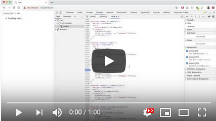

# WASM Moddable tools issue

A video of the issue and work-around is available [here](https://youtu.be/y1AbuCafJ68).

<a href="https://youtu.be/y1AbuCafJ68"></a>

## Steps to reproduce

1. Download the `sample-mod` folder from this repository.

2. Open the JavaScript console in Chrome and go to [`https://moddable-wasm-tools.netlify.com/`](https://moddable-wasm-tools.netlify.com/).

3. Click the **Choose Files** button in the top left corner, select the `sample-mod` folder from this repository, and click **Upload**.

4. The WASM Moddable tools run in a worker and throw the following error:

	```js
	Uncaught (in promise) RangeError: Maximum call stack size exceeded
	```
	
## Instructions for running locally

1. Clone this repository, navigate to the directory, and start a web server:

	```
	git clone https://github.com/lprader/wasm-tools.git
	cd wasm-tools
	python -m SimpleHTTPServer 8000
	```

2. Open the JavaScript console in Chrome and go to [`http://localhost:8000`](http://localhost:8000).

3. Click the **Choose Files** button in the top left corner, select the `sample-mod` folder from this repository, and click **Upload**.

4. The WASM Moddable tools run in a worker and throw the following error:

	```js
	Uncaught (in promise) RangeError: Maximum call stack size exceeded
	```
	
## Building the tools

To build the WASM Moddable tools (`tools.wasm` and `tools.js`) yourself, you'll need to install Emscripten and the Moddable SDK. Full instructions are available in [this repository](https://github.com/phoddie/runmod/blob/master/wasmtools.md).

The version included in this repository was built with Emscripten version `1.38.31` and the Moddable SDK commit `6c524c2f3f9187943346cd869d1b284cbf75b7de`. Note that these are not the most current versions of Emscripten or the Moddable SDK. The problem is reproducible using other versions.